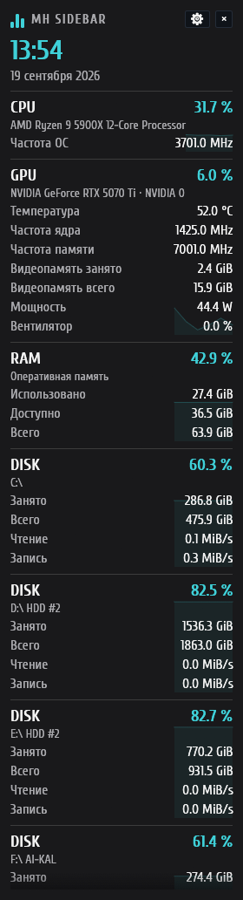

# MH Sidebar

MH Sidebar показывает загрузку CPU и GPU, память, диски и сеть в боковой панели Windows 10/11 x64, Linux и macOS. Приложение написано на Rust и запускается без установки. В интерфейсе используются шрифт Cuprum, тёмные карточки и оформление MH Monitoring.



## Первый запуск в Windows

1. Распакуйте `MH-Sidebar-v0.5.2-windows-x64.zip` или возьмите `MH-Sidebar.exe` из `dist/v0.5.2/`.
2. Запустите EXE. В открывшихся настройках выберите монитор, сторону и ширину панели, затем нажмите **Готово**. Если монитор один, приложение использует его; при двух по умолчанию выбирается второй.
3. Если нужен автозапуск с доступом к датчикам PawnIO, подтвердите запрос Windows на повышение прав. Автозапуск включён в начальных настройках. При отказе настройки останутся открытыми, а задача автозапуска не создастся.

При обычном ручном запуске права администратора не нужны. Они требуются для показаний температуры и мощности CPU через PawnIO. Сам драйвер [PawnIO](https://pawnio.eu/) устанавливается отдельно.

Левый клик по значку в трее скрывает или возвращает панель. Правый клик открывает настройки, включает пропуск кликов, перезапускает датчики или завершает программу. Кнопка `×` только скрывает панель; для выхода выберите **Выход** в трее. Длинную панель можно прокрутить колесом мыши.

| Сочетание по умолчанию | Действие |
| --- | --- |
| **Ctrl+Alt+F11** | Показать или скрыть панель |
| **Ctrl+Alt+F10** | Включить или выключить пропуск кликов |
| **Ctrl+Alt+F12** | Открыть настройки |

Сочетания можно изменить. Если включён пропуск кликов, пользуйтесь треем или горячими клавишами.

## Показатели

| Устройство | Что показывает панель |
| --- | --- |
| CPU | Загрузка, логические потоки и частота по данным Windows; с PawnIO также температура и мощность. Частота ОС не равна мгновенному boost каждого ядра. |
| NVIDIA GPU | Загрузка, температура, частоты, видеопамять, мощность и вентилятор через NVML установленного драйвера. |
| Другие GPU | Загрузка и видеопамять через WDDM/PDH; остальные датчики только при поддержке драйвером. |
| ОЗУ | Занято, доступно, всего и процент использования. |
| Диски | Объём томов, занятое место и чтение/запись через PDH. Процент означает заполнение тома. |
| Сеть | Приём и передача по отдельным интерфейсам, включая виртуальные. |

Память выводится в GiB, скорость в MiB/s. Для скорости нужны два замера. Недоступное значение не подменяется нулём: его причину можно посмотреть в настройках устройства. Там же можно скрыть такие строки. Температура дисков по SMART и скорость модулей RAM не поддерживаются.

### Температура и мощность CPU

MH Sidebar работает с AMD Ryzen Zen 1–5 и процессорами Intel с цифровым датчиком, для которых подходит модуль PawnIO. В настройках CPU нажмите **Установить PawnIO**: приложение откроет установку через `winget`. Если `winget` недоступен, там же можно перейти на сайт драйвера. После установки нажмите **Перезапустить от имени администратора**.

Состояние датчика и причина отказа показаны в настройках. Если температура и мощность отсутствуют три замера подряд, приложение повторно открывает датчик с возрастающей задержкой до 30 секунд. Кнопка **Перезапуск датчиков** запускает проверку заново. Остальные показатели продолжают работать без PawnIO.

В EXE встроены модули `AMDFamily17` и `IntelMSR`; драйвер в пакет не входит. Сведения об их происхождении и лицензии находятся в [assets/pawnio/NOTICE.md](assets/pawnio/NOTICE.md). Приложение не поставляет WinRing0, LibreHardwareMonitor, PresentMon и отдельную службу.

## Настройка панели

В окне настроек сразу виден предпросмотр. **Применить** сохраняет изменения, **Отмена** их отбрасывает. Блоки и показатели внутри блоков меняются местами перетаскиванием или стрелками; строки логических потоков CPU перемещаются вместе. Для каждого блока можно выбрать устройства, строки и показатель графика. В разделе внешнего вида доступны три плотности: компактная, обычная и свободная.

Раздел **Профили** содержит минимальный, игровой и рабочий варианты. Можно сохранять и удалять собственные. Профиль меняет оформление, часы, блоки и выбор устройств. Монитор, автозапуск, видимость, сочетания клавиш и температурные пороги остаются текущими. Импорт JSON меняет черновик до нажатия **Применить**; экспорт сохраняет текущий черновик. Файлы импорта ограничены 1 МиБ.

Файл настроек находится по пути `%APPDATA%/MH Sidebar/settings.json` в Windows, `$XDG_CONFIG_HOME/mh-sidebar/settings.json` (или `~/.config/mh-sidebar/settings.json`) в Linux и `~/Library/Application Support/MH Sidebar/settings.json` в macOS. Перед переносом старой схемы приложение сохраняет её исходный JSON как `settings.v1.json`, `settings.v2.json` или `settings.v3.json`; уже существующая копия не затирается. Повреждённый файл сохраняется под именем `settings.corrupted-<timestamp>.json`. Настройки более новой схемы приложение не перезаписывает.

Опция **Зарезервировать пространство** не даёт развёрнутым окнам занимать место панели. По умолчанию она выключена. Если панель задач Windows расположена сбоку и перекрывает MH Sidebar, включите резервирование.

### Автозапуск

Пункт **Запускать от администратора при входе в Windows** находится в разделе **Общие**. При включении Windows один раз запросит подтверждение UAC. Приложение создаст интерактивную задачу Планировщика для текущей учётной записи; при следующих входах в систему она запустит EXE с повышенными правами без повторного запроса. Учётная запись должна иметь права администратора. Если UAC предлагает данные другой учётной записи, создание задачи отменяется.

Старую запись автозапуска в `HKCU\Software\Microsoft\Windows\CurrentVersion\Run` приложение переносит при запуске обновлённой версии. Если вы переместили EXE, выключите и снова включите автозапуск, чтобы задача получила новый путь. Поведение реального входа в Windows с созданной задачей пока требует ручной проверки; подробности приведены в [матрице совместимости](docs/COMPATIBILITY.md).

## Графики и предупреждения

Нажмите на название блока или показатель, чтобы открыть увеличенный график. Интервал истории настраивается от 30 до 300 секунд. Окно показывает текущее значение, состояние источника, число доступных замеров, минимум, среднее арифметическое и максимум. При наведении видны время и значение ближайшей точки. Пропуски остаются разрывами.

Из графика можно экспортировать CSV для выбранного показателя или всей истории текущего сеанса. Файл содержит время Unix в миллисекундах, время от запуска, блок, ID и имя устройства, показатель, подпись, единицу и значение. Недоступные значения остаются пустыми. История хранится только в памяти и исчезает после выхода из приложения.

В разделе **Предупреждения** можно включить уведомления Windows и задать для каждого правила показатель, устройство, порог, длительность превышения и паузу между уведомлениями. Недоступные и устаревшие показания их не вызывают. Уведомления по умолчанию выключены; звук приложение не воспроизводит. Цветовые пороги температуры CPU и GPU настраиваются отдельно и работают независимо от уведомлений.

## Достоверность показаний и совместимость

CPU, PawnIO, RAM, GPU, диски и сеть опрашиваются независимо. У каждого источника есть состояние и время последнего замера. Если данные устарели, только его строки становятся недоступными. Зависший системный вызов не останавливает остальные источники или интерфейс, но для восстановления самого источника может потребоваться перезапуск приложения.

Устройства выбираются по ID. Поэтому переименование сетевого интерфейса не создаёт новый график, а отключённое устройство остаётся в истории до окончания выбранного интервала. Если Windows не даёт постоянный ID, настройки сообщают об ограничении. Сопоставление NVML и WDDM проверено на RTX 5070 Ti; для других сочетаний GPU его нужно проверить отдельно.

На Windows 11 25H2 с двумя мониторами проверены 150% DPI на основном экране, 125% на втором, размещение панели с обеих сторон, скрытие и восстановление рабочей области. Windows 10, физическое отключение экранов, смена DPI во время работы, сон и перезапуск Explorer остаются без полной ручной проверки. Результаты и условия замера ресурсов приведены в [docs/COMPATIBILITY.md](docs/COMPATIBILITY.md), история проверок в [docs/VALIDATION.md](docs/VALIDATION.md).

Приложение не отправляет телеметрию и не проверяет обновления по сети. Выпуск не подписан Authenticode, поэтому Windows может показать предупреждение SmartScreen. Контрольные суммы файлов пакета находятся в `SHA256SUMS.txt`, сумма ZIP в соседнем файле `.zip.sha256`.

## Сборка из исходников

Для Windows нужны x64, стабильный Rust с MSVC toolchain, Windows SDK и Visual Studio Build Tools с C++.

```powershell
cargo fmt --check
cargo test --locked
cargo clippy --locked --all-targets -- -D warnings
powershell -ExecutionPolicy Bypass -File tools/build-release.ps1
powershell -ExecutionPolicy Bypass -File tools/verify-release.ps1 -PackageDirectory dist/v0.5.2 -ExpectedVersion 0.5.2
```

Скрипт выпуска берёт версию из `Cargo.toml`, создаёт `dist/v0.5.2/` и ZIP, проверяет состав пакета, SHA-256 файлов и архитектуру EXE. Если каталог версии уже существует, сборка остановится, не заменяя прежний пакет. CI выполняет форматирование, тесты, Clippy и сборку на Windows; аппаратные сценарии и поведение UAC требуют проверки на целевой машине.

### Linux и macOS

Для Linux нужен стабильный Rust, компилятор C и библиотеки GTK 3, AppIndicator, X11/Xdo и OpenGL. На Ubuntu установите их командой:

```sh
sudo apt-get install libgtk-3-dev libayatana-appindicator3-dev libxdo-dev libxkbcommon-dev libgl1-mesa-dev zenity libnotify-bin x11-xserver-utils
cargo build --locked --release --bin MH-Sidebar
./target/release/MH-Sidebar
```

Для macOS нужны стабильный Rust и Xcode Command Line Tools:

```sh
xcode-select --install
cargo build --locked --release --bin MH-Sidebar
./target/release/MH-Sidebar
```

В CI macOS также создаётся архив с `MH Sidebar.app`. Приложение пока не подписано сертификатом Apple.

В [GitHub Releases](https://github.com/midnightheartsgames/MH-Sidebar/releases) публикуются архивы для Windows x64, Linux x64, macOS Apple Silicon и macOS Intel. У каждого архива есть файл `.sha256` для проверки загрузки. Релиз появляется после успешной сборки и тестов на всех четырёх платформах.

В Linux автозапуск настраивается через XDG Autostart, в macOS — через LaunchAgent текущего пользователя. Linux-диалоги импорта и экспорта используют `zenity` или `kdialog`, уведомления — `notify-send`; macOS использует системные диалоги и уведомления. Значок в системном трее нужен, чтобы вернуть скрытую панель. Если его не удалось создать, приложение оставляет панель видимой и открывает настройки.

Сейчас Linux/macOS используют `sysinfo` для CPU, памяти, дисков и сети, NVML для NVIDIA GPU и доступный системный датчик температуры CPU. Мощность CPU и показатели GPU без NVML могут отсутствовать. Резервирование места на рабочем столе работает только в Windows. Linux получает геометрию экранов через `xrandr` в X11; в Wayland выбор нескольких экранов и точное закрепление панели зависят от композитора и ещё не подтверждены. macOS получает геометрию через Core Graphics; панель пока может перекрывать строку меню или Dock. CI собирает Linux и macOS на соответствующих системах; ручной запуск на этих ОС ещё нужно проверить.

Для диагностики доступны примеры `probe`, `pawnio_probe`, `collection_probe`, `compatibility_probe` и `dock_probe` в каталоге `examples/`. `dock_probe` кратковременно резервирует рабочую область и должен запускаться в обычном сеансе Explorer. Скрипты `tools/gui-smoke.ps1` и `tools/measure-resources.ps1` проверяют интерфейс и потребление ресурсов с отдельным конфигом. Тестовый запуск приложения также принимает `--config "C:/path/settings.json" --settings` и `--smoke-test 15`.

## Лицензии

Код распространяется по [MIT](LICENSE). Оформление и адаптированные модули MH Monitoring принадлежат © 2026 midnightheartsgames. Шрифт Cuprum распространяется по SIL OFL 1.1. Условия для остальных компонентов приведены в [THIRD-PARTY.md](THIRD-PARTY.md), [assets/fonts/OFL.txt](assets/fonts/OFL.txt) и [assets/pawnio/COPYING](assets/pawnio/COPYING).
